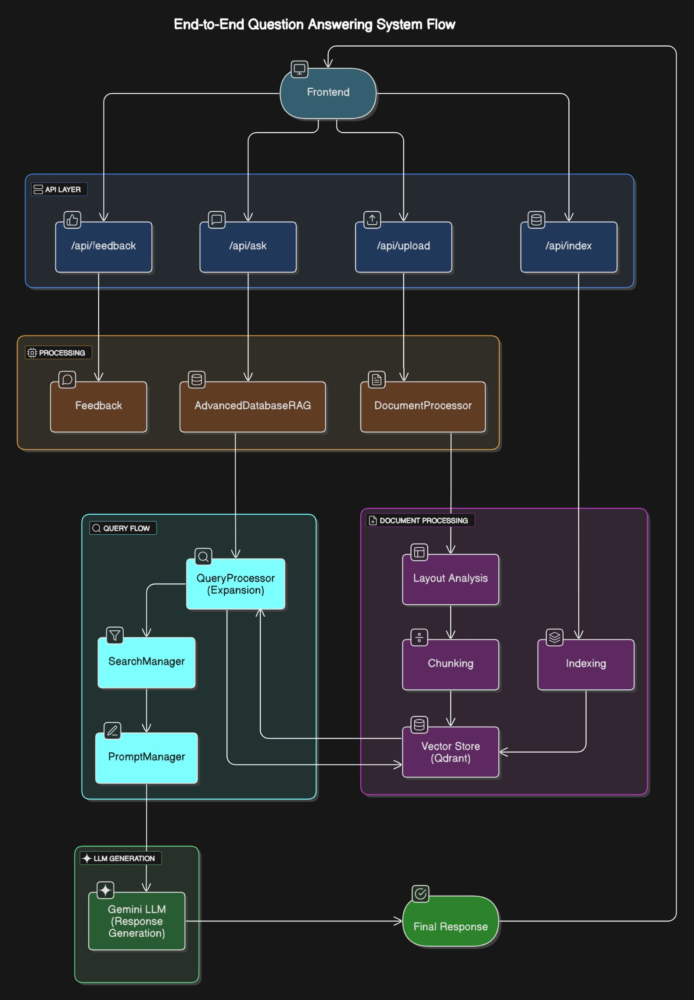

# Hệ thống RAG cho Cơ sở dữ liệu

Hệ thống RAG (Retrieval-Augmented Generation) tìm kiếm thông tin và trả lời câu hỏi về Cơ sở dữ liệu.

## Cấu trúc thư mục

```
D:/DATN/V2/
├── requirements.txt         # Danh sách thư viện cần thiết
└── src/                     # Thư mục mã nguồn
    ├── __init__.py          # Đánh dấu thư mục là package Python
    ├── embedding.py         # Module quản lý mô hình embedding
    ├── llm.py               # Module quản lý mô hình ngôn ngữ lớn
    ├── vector_store.py      # Module quản lý kho lưu trữ vector
    ├── document_processor.py # Module xử lý tài liệu
    ├── prompt_manager.py    # Module quản lý prompt
    ├── search.py            # Module quản lý tìm kiếm
    ├── query_processor.py   # Module xử lý truy vấn đơn giản
    ├── rag.py               # Module tổng hợp hệ thống RAG
    ├── api.py               # Module API FastAPI
    ├── .env                 # File cấu hình biến môi trường
    ├── .env.example         # File mẫu cấu hình biến môi trường
    ├── conversation_history/ # Thư mục lưu trữ lịch sử hội thoại
    ├── UI/                  # Thư mục giao diện người dùng
    │   ├── index.html       # Trang chính của ứng dụng web
    │   └── assets/          # Thư mục tài nguyên
    │       ├── css/         # Stylesheet
    │       ├── js/          # JavaScript
    │       └── img/         # Hình ảnh 
    ├── img/                 # Thư mục hình ảnh
    │   ├── Ui/              # Hình ảnh giao diện người dùng
    │   └── Diagram/         # Hình ảnh sơ đồ hệ thống
    ├── feedback/            # Thư mục lưu phản hồi người dùng
    └── data/                # Thư mục chứa dữ liệu
```

## Cài đặt và sử dụng

### Cài đặt thủ công

1. **Tạo môi trường ảo Python**:
   ```
   python -m venv venv
   ```

2. **Kích hoạt môi trường ảo**:
   ```
   venv\Scripts\activate
   ```

3. **Cài đặt các thư viện cần thiết**:
   ```
   pip install -r requirements.txt
   ```

4. **Chạy API**:
   ```
   python -m uvicorn src.api:app --host 0.0.0.0 --port 8000 --reload
   ```

## Lưu ý về tính năng đã loại bỏ

Hệ thống này đã loại bỏ hai tính năng để tối ưu hiệu suất và đơn giản hóa mã nguồn:

1. **Layout Detection**: Đã loại bỏ tính năng phân tích layout của PDF. Tài liệu PDF giờ đây được xử lý bằng phương pháp chunking thông thường, giúp:
   - Giảm phụ thuộc vào các thư viện phức tạp như layoutparser, opencv, pdf2image, pytesseract
   - Cải thiện tốc độ xử lý tài liệu
   - Tăng tính ổn định khi xử lý nhiều định dạng PDF khác nhau

2. **Query Expansion**: Đã loại bỏ tính năng mở rộng truy vấn, giúp:
   - Đơn giản hóa quá trình tìm kiếm
   - Giảm thời gian phản hồi
   - Loại bỏ phụ thuộc vào các mô hình và từ điển đồng nghĩa phức tạp

## Tính năng lưu trữ lịch sử hội thoại

Hệ thống bao gồm một tính năng lưu trữ lịch sử hội thoại, cho phép:

- Lưu trữ tất cả các cuộc hội thoại giữa người dùng và hệ thống
- Tạo session ID duy nhất cho mỗi phiên hội thoại
- Lưu trữ lịch sử truy vấn, câu trả lời và các nguồn dữ liệu được tham khảo
- Tự động lưu các phiên trong thư mục `conversation_history`
- Phân tích và học hỏi từ các phiên trước để cải thiện phản hồi

Các file hội thoại được lưu trữ dưới dạng JSON, bao gồm:
- ID phiên hội thoại
- Thời gian bắt đầu và kết thúc
- Danh sách các tin nhắn (người dùng và hệ thống)
- Thông tin về các nguồn dữ liệu được sử dụng

## SƠ ĐỒ HOẠT ĐỘNG



## Sử dụng hệ thống

### API
Khi chạy API, bạn có thể sử dụng các endpoint sau:
- **API Documentation**: Truy cập http://localhost:8000/docs để xem tài liệu API Swagger
- **Đường dẫn chính**: http://localhost:8000

### Giao diện người dùng (Frontend)

Hệ thống bao gồm giao diện người dùng web được xây dựng bằng HTML, CSS và JavaScript. Để sử dụng giao diện:

1. **Khởi động API backend**:
   - Sử dụng lệnh `python -m uvicorn src.api:app --host 0.0.0.0 --port 8000 --reload`
   - Đảm bảo API đang chạy tại http://localhost:8000

2. **Mở giao diện web**:
   - Mở file `src/UI/index.html` trong trình duyệt web
   - Hoặc sử dụng một máy chủ web đơn giản để phục vụ thư mục `src/UI`

3. **Các tính năng chính**:
   - **Panel Nguồn**: Hiển thị danh sách tài liệu đã tải lên, cho phép chọn tài liệu để sử dụng khi đặt câu hỏi
   - **Panel Hội thoại**: Nơi đặt câu hỏi và xem câu trả lời từ hệ thống RAG
   - **Panel Xem nguồn**: Hiển thị nội dung chi tiết của tài liệu nguồn

4. **Cách sử dụng**:
   - **Tải tài liệu**: Nhấn vào nút "Thêm" trong panel Nguồn để mở hộp thoại tải lên tài liệu mới
   - **Chọn tài liệu**: Đánh dấu các tài liệu bạn muốn sử dụng làm nguồn cho câu hỏi
   - **Đặt câu hỏi**: Nhập câu hỏi của bạn vào ô văn bản ở cuối panel Hội thoại và nhấn Enter hoặc nút Gửi
   - **Xem thông tin nguồn**: Nhấp vào các nguồn tham khảo được hiển thị trong câu trả lời để xem nội dung đầy đủ

5. **Tính năng khác**:
   - **Chế độ tối/sáng**: Nhấn vào biểu tượng mặt trăng/mặt trời ở góc trên bên phải để chuyển đổi giữa chế độ tối và sáng
   - **Xem trên thiết bị di động**: Giao diện tự động điều chỉnh để phù hợp với màn hình thiết bị di động
   - **Xóa tài liệu**: Nhấp vào biểu tượng cây chổi bên cạnh tên tài liệu để xóa tài liệu khỏi hệ thống
   - **Xóa hội thoại**: Nhấn vào biểu tượng cây chổi ở góc trên bên phải panel Hội thoại để xóa toàn bộ hội thoại hiện tại

6. **Cấu hình kết nối API**:
   - Nếu API chạy trên URL khác, bạn có thể thay đổi cấu hình trong file `src/UI/assets/js/api-service.js` bằng cách sửa giá trị của biến `API_BASE_URL`

### Minh họa giao diện

#### Trang chủ


#### Hỏi đáp


#### Tải lên tài liệu


## Tài liệu chi tiết các API endpoint

### 1. Đặt câu hỏi
**Endpoint**: `POST /api/ask`

**Mô tả**: Đặt câu hỏi và nhận câu trả lời từ hệ thống RAG

**Tham số đầu vào**:
- **Body** (JSON):
  ```json
  {
    "question": "string",
    "search_type": "hybrid", // tùy chọn: "semantic", "keyword", "hybrid"
    "alpha": 0.7, // tùy chọn: hệ số kết hợp giữa semantic và keyword search
    "sources": ["file1.pdf", "file2.docx"] // tùy chọn: danh sách các file nguồn
  }
  ```
- **Query Parameters**:
  - `max_sources`: Số lượng nguồn tham khảo tối đa trả về. Nếu không chỉ định, sẽ trả về tất cả kết quả. (1-50)

**Kết quả trả về**:
```json
{
  "question_id": "string",
  "question": "string",
  "answer": "string",
  "sources": [
    {
      "source": "string",
      "score": 0.95,
      "content_snippet": "string"
    }
  ],
  "search_method": "string",
  "total_reranked": 15
}
```

### 2. Đặt câu hỏi dạng stream
**Endpoint**: `POST /api/ask/stream`

**Mô tả**: Đặt câu hỏi và nhận câu trả lời từ hệ thống RAG dưới dạng stream, giúp hiển thị từng phần câu trả lời ngay khi được tạo ra thay vì đợi toàn bộ câu trả lời hoàn thành.

**Tham số đầu vào**:
- **Body** (JSON): Giống như endpoint `/api/ask`
  ```json
  {
    "question": "string",
    "search_type": "hybrid", // tùy chọn: "semantic", "keyword", "hybrid"
    "alpha": 0.7, // tùy chọn: hệ số kết hợp giữa semantic và keyword search
    "sources": ["file1.pdf", "file2.docx"] // tùy chọn: danh sách các file nguồn
  }
  ```
- **Query Parameters**:
  - `max_sources`: Số lượng nguồn tham khảo tối đa trả về. (1-50)

**Kết quả trả về**: Server-Sent Events (SSE) với các loại sự kiện:
- **sources**: Danh sách các nguồn tham khảo
  ```
  event: sources
  data: {"sources": [...], "question": "string", "search_method": "string", ...}
  ```
- **content**: Từng phần nội dung của câu trả lời
  ```
  event: content
  data: {"content": "phần nội dung câu trả lời"}
  ```
- **end**: Đánh dấu kết thúc quá trình trả lời
  ```
  event: end
  data: {"processing_time": 2.5}
  ```
- **error**: Thông báo lỗi (nếu có)
  ```
  event: error
  data: {"error": true, "message": "Mô tả lỗi"}
  ```

### 3. Tải lên tài liệu
**Endpoint**: `POST /api/upload`

**Mô tả**: Tải lên một tài liệu để thêm vào hệ thống. Tài liệu sẽ được tự động xử lý và index.

**Tham số đầu vào**:
- **Form Data**:
  - `file`: File tài liệu (PDF, DOCX, TXT, SQL)
  - `category`: Danh mục tài liệu (tùy chọn)

**Kết quả trả về**:
```json
{
  "filename": "string",
  "status": "success",
  "message": "string",
  "chunks_count": 25,
  "category": "string"
}
```

### 4. Index tài liệu
**Endpoint**: `POST /api/index`

**Mô tả**: Bắt đầu quá trình indexing tất cả tài liệu trong thư mục data

**Tham số đầu vào**: Không có

**Kết quả trả về**:
```json
{
  "status": "started",
  "message": "Đã bắt đầu quá trình indexing..."
}
```

### 5. Kiểm tra trạng thái indexing
**Endpoint**: `GET /api/index/status`

**Mô tả**: Kiểm tra trạng thái của quá trình indexing

**Tham số đầu vào**: Không có

**Kết quả trả về**:
```json
{
  "status": "completed",
  "message": "Đã hoàn thành index 120 chunks từ 5 tài liệu",
  "processed_files": 5
}
```

### 6. Thông tin collection
**Endpoint**: `GET /api/collection/info`

**Mô tả**: Lấy thông tin về collection trong vector store

**Tham số đầu vào**: Không có

**Kết quả trả về**:
```json
{
  "name": "csdl_rag_e5_base",
  "points_count": 120,
  "config": {
    "params": {
      "size": 768,
      "distance": "Cosine"
    }
  }
}
```

### 7. Gửi phản hồi
**Endpoint**: `POST /api/feedback`

**Mô tả**: Gửi phản hồi về câu trả lời của hệ thống

**Tham số đầu vào**:
- **Body** (JSON):
  ```json
  {
    "question_id": "string",
    "rating": 5,
    "comment": "string",
    "is_helpful": true,
    "specific_feedback": {
      "accuracy": 5,
      "completeness": 4,
      "clarity": 5
    }
  }
  ```

**Kết quả trả về**:
```json
{
  "status": "success",
  "message": "Đã lưu phản hồi của bạn. Cảm ơn!"
}
```

### 8. Xem thống kê phản hồi
**Endpoint**: `GET /api/feedback/stats`

**Mô tả**: Lấy thống kê về phản hồi người dùng

**Tham số đầu vào**: Không có

**Kết quả trả về**:
```json
{
  "status": "success",
  "message": "Thống kê phản hồi",
  "total_feedback": 25,
  "average_rating": 4.2,
  "helpful_percentage": 85.5,
  "ratings_distribution": {
    "1": 1,
    "2": 2,
    "3": 3,
    "4": 8,
    "5": 11
  }
}
```

### 9. Phân tích SQL
**Endpoint**: `POST /api/analyze/sql`

**Mô tả**: Phân tích và đề xuất cải tiến cho truy vấn SQL

**Tham số đầu vào**:
- **Body** (JSON):
  ```json
  {
    "sql_query": "SELECT * FROM users WHERE id = 1",
    "database_context": "Hệ thống quản lý người dùng với các bảng users, roles, permissions"
  }
  ```

**Kết quả trả về**:
```json
{
  "query": "string",
  "analysis": "string",
  "suggestions": [
    "Thêm index cho cột id",
    "Chỉ chọn các cột cần thiết thay vì SELECT *"
  ],
  "optimized_query": "SELECT username, email FROM users WHERE id = 1"
}
```

### 10. Tìm kiếm ngữ nghĩa
**Endpoint**: `POST /api/search/semantic`

**Mô tả**: Tìm kiếm ngữ nghĩa theo câu truy vấn

**Tham số đầu vào**:
- **Body** (JSON):
  ```json
  {
    "question": "string"
  }
  ```
- **Query Parameters**:
  - `k`: Số lượng kết quả trả về (mặc định: 5)

**Kết quả trả về**:
```json
{
  "query": "string",
  "results": [
    {
      "text": "string",
      "metadata": {},
      "score": 0.95,
      "category": "string"
    }
  ]
}
```

### 11. Tìm kiếm kết hợp (hybrid)
**Endpoint**: `POST /api/search/hybrid`

**Mô tả**: Tìm kiếm kết hợp (hybrid) theo câu truy vấn

**Tham số đầu vào**:
- **Body** (JSON):
  ```json
  {
    "question": "string"
  }
  ```
- **Query Parameters**:
  - `k`: Số lượng kết quả trả về (mặc định: 5)
  - `alpha`: Hệ số kết hợp (0.7 = 70% semantic + 30% keyword) (mặc định: 0.7)

**Kết quả trả về**:
```json
{
  "query": "string",
  "results": [
    {
      "text": "string",
      "metadata": {},
      "score": 0.95,
      "category": "string"
    }
  ]
}
```

### 12. Thống kê danh mục
**Endpoint**: `GET /api/categories`

**Mô tả**: Lấy thống kê về các danh mục tài liệu

**Tham số đầu vào**: Không có

**Kết quả trả về**:
```json
{
  "total_documents": 120,
  "documents_by_category": {
    "sql": 45,
    "database_design": 30,
    "nosql": 25,
    "general": 20
  },
  "categories": ["sql", "database_design", "nosql", "general"]
}
```

### 13. Reset collection
**Endpoint**: `DELETE /api/collection/reset`

**Mô tả**: Xóa toàn bộ dữ liệu đã index trong collection

**Tham số đầu vào**: Không có

**Kết quả trả về**:
```json
{
  "status": "success",
  "message": "Đã xóa và tạo lại collection csdl_rag_e5_base",
  "vector_size": 768
}
```

### 14. Lấy danh sách file
**Endpoint**: `GET /api/files`

**Mô tả**: Lấy danh sách các file đã được upload vào hệ thống

**Tham số đầu vào**: Không có

**Kết quả trả về**:
```json
{
  "total_files": 5,
  "files": [
    {
      "filename": "sql_basics.pdf",
      "path": "D:/DATN/V2/src/data/sql_basics.pdf",
      "size": 2456789,
      "upload_date": "2023-06-15T14:30:25",
      "extension": ".pdf",
      "category": null
    },
    {
      "filename": "database_design.docx",
      "path": "D:/DATN/V2/src/data/database_design.docx",
      "size": 1234567,
      "upload_date": "2023-06-10T09:15:30",
      "extension": ".docx",
      "category": null
    }
  ]
}
```

### 15. Xóa file
**Endpoint**: `DELETE /api/files/{filename}`

**Mô tả**: Xóa file đã upload và các index liên quan trong vector store

**Tham số đầu vào**:
- **Path Parameter**:
  - `filename`: Tên file cần xóa

**Kết quả trả về**:
```json
{
  "filename": "sql_basics.pdf",
  "status": "success",
  "message": "Đã xóa file sql_basics.pdf và 45 index liên quan",
  "removed_points": 45
}
```

### 16. Lấy danh sách nguồn
**Endpoint**: `GET /api/files/sources`

**Mô tả**: Lấy danh sách các file nguồn có thể sử dụng để tìm kiếm

**Tham số đầu vào**: Không có

**Kết quả trả về**:
```json
{
  "total_sources": 5,
  "sources": ["src/data/file1.pdf", "src/data/file2.docx", ...],
  "filenames": ["file1.pdf", "file2.docx", ...],
  "recommendation": "Bạn có thể sử dụng sources là tên file đơn thuần hoặc đường dẫn đầy đủ"
}
```

### 17. Xem chi tiết nguồn
**Endpoint**: `GET /api/files/sources/details`

**Mô tả**: Lấy thông tin chi tiết về một nguồn tài liệu cụ thể hoặc tất cả các nguồn

**Tham số đầu vào**:
- **Query Parameters**:
  - `source_name`: (Tùy chọn) Tên file nguồn cần kiểm tra chi tiết

**Kết quả trả về khi không chỉ định source_name**:
```json
{
  "total_sources": 5,
  "sources": {
    "file1.pdf": {
      "count": 25,
      "categories": ["sql", "database_design"]
    },
    "file2.docx": {
      "count": 15,
      "categories": ["nosql"]
    }
  }
}
```

**Kết quả trả về khi chỉ định source_name**:
```json
{
  "source_name": "file1.pdf",
  "total_chunks": 25,
  "chunks": [
    {
      "text": "Đoạn văn bản mẫu...",
      "category": "sql",
      "full_length": 1500
    },
    ...
  ]
}
```

### 18. Xóa dữ liệu theo bộ lọc
**Endpoint**: `POST /api/collections/delete-by-filter`

**Mô tả**: Xóa các điểm dữ liệu trong vector store theo bộ lọc được chỉ định

**Tham số đầu vào**:
- **Body** (JSON):
  ```json
  {
    "filter": {
      "must": [
        {
          "key": "source",
          "match": {
            "value": "tên_file.pdf"
          }
        },
        {
          "key": "user_id",
          "match": {
            "value": "default_user"
          }
        }
      ]
    }
  }
  ```

**Kết quả trả về**:
```json
{
  "status": "success",
  "message": "Đã xóa thành công các điểm dữ liệu khớp với bộ lọc"
}
```

### 19. Lấy lịch sử hội thoại
**Endpoint**: `GET /api/conversations`

**Mô tả**: Lấy danh sách tất cả các hội thoại đã lưu trữ

**Tham số đầu vào**: Không có

**Kết quả trả về**:
```json
{
  "status": "success",
  "message": "Đã tìm thấy 8 hội thoại",
  "conversations": [
    {
      "conversation_id": "session_2uwagwprti7",
      "last_updated": "2023-10-15T10:45:20",
      "message_count": 8,
      "first_message": "Phân biệt giữa INNER JOIN và LEFT JOIN?"
    },
    ...
  ]
}
```

### 20. Chi tiết hội thoại
**Endpoint**: `GET /api/conversations/{conversation_id}`

**Mô tả**: Lấy chi tiết hội thoại cho một phiên cụ thể

**Tham số đầu vào**:
- **Path Parameter**:
  - `conversation_id`: ID phiên hội thoại cần lấy chi tiết

**Kết quả trả về**:
```json
{
  "status": "success",
  "message": "Đã tìm thấy chi tiết hội thoại cho phiên session_2uwagwprti7",
  "data": {
    "conversation_id": "session_2uwagwprti7",
    "last_updated": "2023-10-15T10:45:20",
    "messages": [
      {
        "role": "user",
        "content": "Phân biệt giữa INNER JOIN và LEFT JOIN?"
      },
      {
        "role": "assistant",
        "content": "INNER JOIN chỉ trả về các hàng có sự trùng khớp..."
      },
      ...
    ]
  }
}
```

## Tùy chỉnh

- Bạn có thể thêm dữ liệu mới vào thư mục `src/data`
- Các file hỗ trợ: PDF, DOCX, TXT, SQL
- Tùy chỉnh cấu hình API trong file `src/api.py`
- Tùy chỉnh giao diện người dùng trong thư mục `src/UI`
